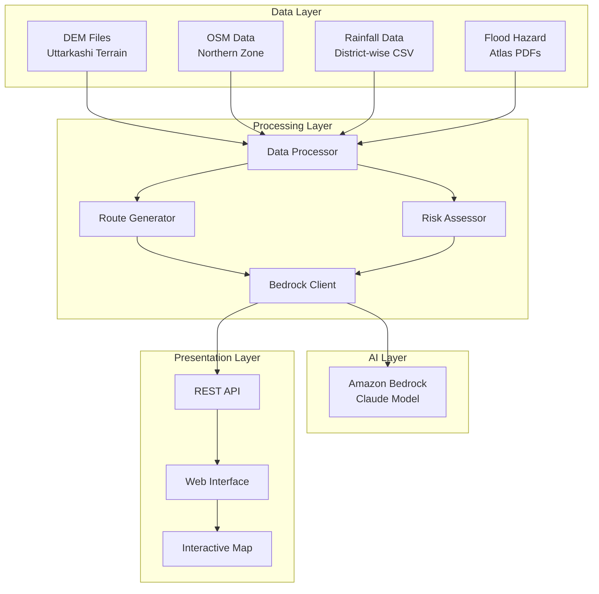

# Design Document: AI-Powered Rural Infrastructure Planning System

## Overview

The AI-Powered Rural Infrastructure Planning System is a geospatial decision support tool that leverages Amazon Bedrock's AI capabilities to assist rural infrastructure planners in early-stage road planning for challenging terrain. The system processes multiple data sources including Digital Elevation Models (DEM), OpenStreetMap data, rainfall patterns, and flood hazard information to generate AI-recommended route alignments with comprehensive risk assessments.

The system follows a Plan-and-Solve AI reasoning pattern, where Amazon Bedrock's Claude model first analyzes the planning requirements, then generates multiple route alternatives, and finally provides natural language explanations for recommendations. This approach enables non-technical planners to understand complex geospatial analysis results and make informed decisions before conducting expensive physical surveys.

## Architecture

### High-Level Architecture



### Component Architecture

The system is organized into distinct layers following separation of concerns:

1. **Data Processing Layer**: Handles ingestion and preprocessing of geospatial data
2. **AI Reasoning Layer**: Integrates with Amazon Bedrock for route generation and explanation
3. **Risk Assessment Layer**: Evaluates terrain, flood, and seasonal risks
4. **Presentation Layer**: Provides interactive web interface with map visualization

## Components and Interfaces

### Data Processing Components

#### API_Client
**Purpose**: Manages all external API integrations with intelligent fallback to local data
**Key Methods**:
- `fetch_elevation_data(bounds: BoundingBox) -> ElevationData`: Queries NASA SRTM/USGS APIs with DEM fallback
- `query_osm_data(bounds: BoundingBox, features: List[str]) -> OSMData`: Uses Overpass API with PBF fallback
- `get_weather_data(location: Coordinate, date_range: DateRange) -> WeatherData`: Fetches from OpenWeatherMap/IMD APIs
- `check_flood_risk(bounds: BoundingBox) -> FloodRiskData`: Queries disaster management APIs with atlas fallback
- `get_infrastructure_data(bounds: BoundingBox) -> InfrastructureData`: Combines multiple APIs for comprehensive infrastructure mapping

**Dependencies**: requests, aiohttp, boto3 (for AWS APIs)
**Features**: Rate limiting, caching, automatic fallback, error handling
**Output**: Unified data structures regardless of source (API or local file)

#### DEM_Processor
**Purpose**: Processes elevation data from APIs or local files to extract terrain metrics
**Key Methods**:
- `load_elevation_data(source: Union[APIResponse, str]) -> DEMData`: Handles both API responses and local TIFF files
- `calculate_slope(dem_data: DEMData) -> SlopeArray`: Computes slope gradients using GDAL DEMProcessing
- `extract_elevation_profile(start: Coordinate, end: Coordinate) -> ElevationProfile`: Gets elevation along route
- `generate_cost_surface(dem_data: DEMData, slope_weights: Dict) -> CostSurface`: Creates weighted cost surface for routing

**Dependencies**: GDAL, rasterio, numpy, requests
**Input**: API elevation data or Uttarkashi DEM file (P5_PAN_CD_N30_000_E078_000_DEM_30m.tif)
**Output**: Processed terrain data with slope, elevation, and cost surface information

#### OSM_Parser
**Purpose**: Extracts road networks and infrastructure from Overpass API or local OSM data
**Key Methods**:
- `query_overpass_api(bounds: BoundingBox, query: str) -> OSMData`: Real-time OSM data queries
- `load_local_osm_data(pbf_file: str, bounds: BoundingBox) -> OSMData`: Fallback to local PBF files
- `extract_road_network() -> RoadNetwork`: Extracts existing road infrastructure
- `find_settlements() -> List[Settlement]`: Identifies villages and populated areas
- `get_existing_infrastructure() -> Infrastructure`: Maps schools, hospitals, markets

**Dependencies**: OSMnx, pyosmium, networkx, requests
**Input**: Overpass API queries or Northern zone OSM data (northern-zone-260121.osm.pbf)
**Output**: Structured road network and infrastructure data

#### Weather_API_Client
**Purpose**: Fetches weather and rainfall data from multiple APIs with local fallbacks
**Key Methods**:
- `get_current_weather(location: Coordinate) -> CurrentWeather`: Real-time weather from OpenWeatherMap
- `fetch_historical_rainfall(location: Coordinate, years: int) -> RainfallHistory`: Historical data from IMD APIs
- `get_monsoon_forecast(region: str) -> MonsoonForecast`: Seasonal predictions for construction planning
- `load_local_rainfall_data(csv_file: str) -> RainfallData`: Fallback to local CSV files

**Dependencies**: requests, pandas, numpy
**Input**: Weather APIs or Rainfall_2016_districtwise.csv and related datasets
**Output**: Seasonal risk assessments and construction timing recommendations

### AI and Route Generation Components

#### Route_Generator
**Purpose**: Generates optimal route alignments using AI-assisted pathfinding
**Key Methods**:
- `generate_routes(start: Coordinate, end: Coordinate, constraints: RouteConstraints) -> List[RouteAlignment]`: Creates multiple route options
- `optimize_alignment(route: RouteAlignment, cost_surface: CostSurface) -> OptimizedRoute`: Refines route using cost surface analysis
- `calculate_route_metrics(route: RouteAlignment) -> RouteMetrics`: Computes distance, elevation gain, construction difficulty

**Dependencies**: networkx, scikit-image, numpy
**Algorithm**: A* pathfinding with weighted cost surface based on terrain difficulty, existing infrastructure proximity, and risk factors
**Output**: Multiple route alternatives with detailed metrics

#### Bedrock_Client
**Purpose**: Interfaces with Amazon Bedrock for AI reasoning and explanations
**Key Methods**:
- `generate_route_explanation(route: RouteAlignment, context: PlanningContext) -> str`: Creates natural language route justification
- `compare_alternatives(routes: List[RouteAlignment]) -> ComparisonAnalysis`: Generates comparative analysis
- `suggest_mitigations(risks: List[Risk]) -> List[Mitigation]`: Recommends risk mitigation strategies
- `plan_construction_sequence(route: RouteAlignment, constraints: Constraints) -> ConstructionPlan`: Suggests implementation phases

**Dependencies**: boto3, amazon-bedrock-runtime
**Model**: Claude 2 or Claude 3 for reasoning and explanation generation
**Prompting Strategy**: Plan-and-Solve pattern for multi-step reasoning

#### Risk_Assessor
**Purpose**: Evaluates and scores route risks across multiple dimensions
**Key Methods**:
- `assess_terrain_risk(route: RouteAlignment, dem_data: DEMData) -> TerrainRisk`: Evaluates slope and elevation challenges
- `assess_flood_risk(route: RouteAlignment, flood_zones: FloodZones) -> FloodRisk`: Analyzes flood exposure
- `assess_seasonal_risk(route: RouteAlignment, rainfall_data: RainfallData) -> SeasonalRisk`: Evaluates monsoon impacts
- `calculate_composite_risk(risks: List[Risk]) -> CompositeRisk`: Combines risk factors into overall score

**Output**: Risk scores (0-100 scale) with detailed breakdowns and explanations

### Presentation Layer Components

#### REST_API
**Purpose**: Provides HTTP endpoints for web interface communication
**Key Endpoints**:
- `POST /api/routes/generate`: Generate route alternatives
- `GET /api/routes/{id}/analysis`: Get detailed route analysis
- `POST /api/routes/compare`: Compare multiple routes
- `GET /api/data/terrain/{bounds}`: Get terrain data for map display
- `GET /api/risks/{route_id}`: Get risk assessment details

**Framework**: FastAPI or Flask
**Authentication**: API key-based for demo purposes
**Response Format**: JSON with GeoJSON for spatial data

#### Web_Interface
**Purpose**: Interactive web application for planners
**Key Features**:
- Interactive map with satellite imagery base layer
- Route drawing and editing tools
- Risk visualization with color-coded overlays
- Comparative analysis dashboard
- Export functionality for reports and GIS data

**Technology Stack**: React/Vue.js frontend, Leaflet/MapBox for mapping
**Map Data**: Satellite imagery from Amazon Location Service or OpenStreetMap

## Data Sources and APIs

### Primary APIs (Real-time Data)

#### Terrain and Elevation APIs
- **NASA SRTM API**: Global elevation data with 30m resolution
- **USGS Elevation API**: Real-time elevation queries for any coordinate
- **Mapbox Terrain API**: High-resolution terrain data with slope calculations
- **Fallback**: Local Uttarkashi DEM file (P5_PAN_CD_N30_000_E078_000_DEM_30m.tif)

#### OpenStreetMap APIs
- **Overpass API**: Real-time queries for roads, settlements, infrastructure
- **Nominatim API**: Geocoding and reverse geocoding for location search
- **OSM Routing APIs**: Existing route networks and accessibility analysis
- **Fallback**: Local OSM PBF file (northern-zone-260121.osm.pbf)

#### Weather and Climate APIs
- **OpenWeatherMap API**: Current weather, forecasts, historical data
- **India Meteorological Department (IMD) APIs**: Official rainfall and weather data
- **NASA POWER API**: Solar radiation, temperature, precipitation data
- **Fallback**: Local rainfall CSV files and historical datasets

#### Flood and Disaster APIs
- **India Disaster Management APIs**: Real-time flood warnings and risk zones
- **Global Flood Database API**: Historical flood data and risk assessments
- **Sentinel Hub API**: Satellite imagery for flood monitoring
- **Fallback**: Local flood hazard atlas PDFs

#### Infrastructure and Connectivity APIs
- **PMGSY API**: Real-time rural road project status and completion data
- **Census API**: Population and settlement data for connectivity planning
- **Google Places API**: Infrastructure locations (hospitals, schools, markets)
- **Fallback**: Local PMGSY CSV files and connectivity survey data

### API Integration Strategy

#### Data Freshness and Caching
- **Real-time Priority**: Always attempt API calls first for most current data
- **Smart Caching**: Cache API responses for 24 hours to reduce API costs
- **Fallback Triggers**: Use local data when APIs return errors or exceed rate limits
- **Data Age Indicators**: Show users whether data is from APIs (fresh) or local files (cached)

#### Cost Optimization
- **API Rate Limiting**: Implement intelligent rate limiting to stay within free tiers
- **Batch Requests**: Combine multiple queries where APIs support batch operations
- **Regional Caching**: Cache frequently requested areas (like Uttarkashi) locally
- **Progressive Loading**: Load essential data first, then enhance with additional API data

#### Error Handling and Resilience
- **Graceful Degradation**: System works with local data even if all APIs fail
- **Partial API Failures**: Use available APIs and fall back to local data for failed services
- **Network Resilience**: Detect network issues and switch to offline mode automatically
- **User Notifications**: Inform users about data source limitations and freshness

### API Integration Models

#### APIResponse
```python
@dataclass
class APIResponse:
    data: Dict[str, Any]
    source: str  # API name
    timestamp: datetime
    cache_expiry: datetime
    success: bool
    error_message: Optional[str] = None
```

#### DataSource
```python
@dataclass
class DataSource:
    primary_api: str
    fallback_file: Optional[str]
    cache_duration: int  # hours
    last_updated: datetime
    is_available: bool
```

#### WeatherData
```python
@dataclass
class WeatherData:
    location: Coordinate
    current_conditions: Dict[str, float]
    rainfall_history: List[float]  # mm per month
    monsoon_forecast: MonsoonForecast
    data_source: str  # "API" or "local"
    freshness: datetime
```

### Core Spatial Data Models

#### Coordinate
```python
@dataclass
class Coordinate:
    latitude: float
    longitude: float
    elevation: Optional[float] = None
```

#### RouteAlignment
```python
@dataclass
class RouteAlignment:
    id: str
    waypoints: List[Coordinate]
    total_distance: float  # kilometers
    elevation_gain: float  # meters
    construction_difficulty: float  # 0-100 scale
    estimated_cost: float  # USD
    estimated_duration: int  # construction days
    risk_score: float  # 0-100 composite risk
```

#### RouteSegment
```python
@dataclass
class RouteSegment:
    start: Coordinate
    end: Coordinate
    length: float
    slope_grade: float
    terrain_type: TerrainType
    risk_factors: List[RiskFactor]
```

### Risk Assessment Models

#### TerrainRisk
```python
@dataclass
class TerrainRisk:
    slope_risk: float  # 0-100 based on gradient
    elevation_risk: float  # 0-100 based on altitude
    stability_risk: float  # 0-100 geological stability
    construction_complexity: float  # 0-100 difficulty score
```

#### FloodRisk
```python
@dataclass
class FloodRisk:
    flood_zone_level: int  # 1-5 flood severity
    seasonal_exposure: float  # months per year at risk
    mitigation_required: bool
    suggested_mitigations: List[str]
```

#### SeasonalRisk
```python
@dataclass
class SeasonalRisk:
    monsoon_months: List[int]  # months with high rainfall
    accessibility_windows: List[DateRange]  # optimal construction periods
    weather_delays: int  # expected delay days per year
```

### AI Integration Models

#### PlanningContext
```python
@dataclass
class PlanningContext:
    start_location: Coordinate
    end_location: Coordinate
    target_villages: List[str]
    budget_constraints: Optional[float]
    timeline_constraints: Optional[int]  # days
    priority_factors: List[str]  # ["cost", "safety", "speed", "accessibility"]
```

#### AIExplanation
```python
@dataclass
class AIExplanation:
    route_rationale: str  # why this route was chosen
    risk_explanation: str  # explanation of risk factors
    alternative_comparison: str  # why alternatives were rejected
    construction_recommendations: str  # implementation advice
    confidence_score: float  # 0-1 AI confidence in recommendation
```

### Data Processing Models

#### DEMData
```python
@dataclass
class DEMData:
    elevation_array: np.ndarray
    slope_array: np.ndarray
    bounds: BoundingBox
    resolution: float  # meters per pixel
    coordinate_system: str  # EPSG code
```

#### OSMData
```python
@dataclass
class OSMData:
    road_network: networkx.Graph
    settlements: List[Settlement]
    infrastructure: List[Infrastructure]
    bounds: BoundingBox
```

#### CostSurface
```python
@dataclass
class CostSurface:
    cost_array: np.ndarray  # weighted cost for each pixel
    weights: Dict[str, float]  # factor weights used
    bounds: BoundingBox
    resolution: float
```

## Correctness Properties

*A property is a characteristic or behavior that should hold true across all valid executions of a system—essentially, a formal statement about what the system should do. Properties serve as the bridge between human-readable specifications and machine-verifiable correctness guarantees.*

Based on the requirements analysis, the following properties ensure the system behaves correctly across all valid inputs and scenarios:

### Data Processing Properties

**Property 1: Comprehensive Data Integration**
*For any* valid combination of DEM, OSM, rainfall, and flood data within geographic bounds, the system should successfully extract all required metrics (elevation, slope, roads, settlements, rainfall patterns, flood zones) and integrate them into a unified geospatial framework within the specified time limit.
**Validates: Requirements 1.1, 1.2, 1.3, 1.4, 1.5**

### Route Generation Properties

**Property 2: Multi-Alternative Route Generation**
*For any* valid start and end coordinate pair, the route generator should produce at least 3 distinct route alignments that consider terrain difficulty, existing infrastructure, and risk factors.
**Validates: Requirements 2.1, 2.2**

**Property 3: Route Completeness**
*For any* generated route, the system should provide complete metrics including distance, estimated cost, construction difficulty rating, and utilize Amazon Bedrock for optimization reasoning.
**Validates: Requirements 2.3, 2.4**

**Property 4: Flood Zone Intersection Handling**
*For any* route that intersects with flood zones, the system should flag all intersection points and provide appropriate mitigation strategies for each flagged segment.
**Validates: Requirements 2.5**

### Risk Assessment Properties

**Property 5: Terrain Risk Calculation**
*For any* generated route over terrain with DEM data, the risk assessor should calculate terrain risk scores that correlate appropriately with slope gradients and elevation changes.
**Validates: Requirements 3.1**

**Property 6: Seasonal Risk Assessment**
*For any* area with rainfall data, the system should identify monsoon impact zones and seasonal accessibility windows that align with historical rainfall patterns.
**Validates: Requirements 3.2**

**Property 7: Flood Risk Scoring**
*For any* route segments passing through flood-prone areas, the system should assign flood risk scores and mark segments appropriately based on flood zone severity.
**Validates: Requirements 3.3**

**Property 8: Risk Visualization and AI Explanation**
*For any* completed risk assessment, the system should display color-coded risk zones on satellite imagery and generate natural language explanations for each identified risk factor through Amazon Bedrock.
**Validates: Requirements 3.4, 3.5**

### Interactive Interface Properties

**Property 9: Route Visualization Overlay**
*For any* generated routes and identified risk zones, the system should display them as distinct colored overlays on satellite imagery with appropriate visual differentiation and semi-transparency for risk zones.
**Validates: Requirements 4.2, 4.3**

**Property 10: Interactive Route Information**
*For any* clickable route segment, the system should display detailed information including risk scores, construction notes, and all relevant metrics when selected.
**Validates: Requirements 4.5**

### Route Comparison Properties

**Property 11: Multi-Route Comparison Display**
*For any* set of multiple generated routes, the system should display them simultaneously with visual distinction and provide a complete comparison table showing distance, cost, risk scores, and construction time for each route.
**Validates: Requirements 5.1, 5.2**

**Property 12: Trade-off Analysis**
*For any* routes with different risk profiles, the system should highlight trade-offs between safety, cost, and construction difficulty, and generate comparative analysis explaining preference scenarios through Amazon Bedrock.
**Validates: Requirements 5.3, 5.4**

**Property 13: Route Filtering**
*For any* applied filter criteria (risk levels, budget constraints), the system should display only routes that meet the specified criteria and hide those that don't.
**Validates: Requirements 5.5**

### AI Explanation Properties

**Property 14: Comprehensive Route Explanation**
*For any* recommended route, Amazon Bedrock should generate natural language explanations that address terrain factors, existing infrastructure, risk assessments, and the rationale for route selection.
**Validates: Requirements 6.1, 6.2**

**Property 15: Seasonal Risk Recommendations**
*For any* identified seasonal risks, Amazon Bedrock should provide specific recommendations for construction timing and mitigation measures.
**Validates: Requirements 6.3**

**Property 16: Alternative Route Rationale**
*For any* set of routes where alternatives are rejected, the system should generate summary reports explaining the rationale for each rejection.
**Validates: Requirements 6.4**

**Property 17: High-Risk Engineering Solutions**
*For any* routes with high flood or terrain risks, the system should suggest specific engineering solutions or route modifications appropriate to the risk level.
**Validates: Requirements 6.5**

### Data Export Properties

**Property 18: Multi-Format Export**
*For any* route, the system should successfully export coordinates in all standard GIS formats (GeoJSON, KML, Shapefile) with valid, parseable data in each format.
**Validates: Requirements 7.1**

**Property 19: Comprehensive Report Generation**
*For any* completed analysis, the system should generate PDF reports containing maps, risk assessments, AI explanations, cost estimates, and construction timeline projections.
**Validates: Requirements 7.2, 7.3**

**Property 20: Comparative Export**
*For any* route comparison scenario, the system should export comparative analysis tables containing all relevant metrics for all compared routes.
**Validates: Requirements 7.4**

**Property 21: Data Provenance Tracking**
*For any* recommendation or analysis result, the system should maintain and provide data provenance information correctly identifying all contributing datasets.
**Validates: Requirements 7.5**

### Performance Properties

**Property 22: Response Time Performance**
*For any* route generation request, the system should complete analysis and display results within 30 seconds regardless of reasonable input complexity.
**Validates: Requirements 8.1**

**Property 23: Large File Handling**
*For any* DEM file up to 1GB in size, the system should process the data without performance degradation compared to smaller files.
**Validates: Requirements 8.2**

**Property 24: OSM Processing Efficiency**
*For any* OSM data within reasonable size limits, the system should efficiently parse and index road networks with processing time scaling appropriately with data complexity.
**Validates: Requirements 8.3**

**Property 25: UI Responsiveness**
*For any* background data processing operation, the user interface should remain responsive to user interactions without blocking or significant delays.
**Validates: Requirements 8.4**

**Property 26: Concurrent User Performance**
*For any* number of concurrent users within system capacity, each user session should maintain the same performance standards as single-user scenarios.
**Validates: Requirements 8.5**

### Error Handling Properties

**Property 27: Data Corruption Detection**
*For any* corrupted or incomplete DEM data, the system should detect the corruption and provide clear, actionable error messages to the user.
**Validates: Requirements 9.1**

**Property 28: Input Validation**
*For any* invalid geographic coordinates or input parameters, the system should reject the input and provide helpful feedback explaining the validation failure.
**Validates: Requirements 9.2**

**Property 29: Missing Data Handling**
*For any* scenario where required datasets are unavailable, the system should identify which data sources are missing and explain how this affects the analysis capabilities.
**Validates: Requirements 9.3**

**Property 30: Network Resilience**
*For any* network connectivity issues, the system should handle them gracefully and provide offline capabilities where possible without complete system failure.
**Validates: Requirements 9.4**

**Property 31: Error Logging and User Communication**
*For any* data processing failure, the system should log detailed error information for troubleshooting while displaying user-friendly error messages that don't expose technical details.
**Validates: Requirements 9.5**

### Regional Specialization Properties

**Property 32: Uttarkashi-Specific Analysis**
*For any* routes within Uttarkashi district, the system should apply region-specific slope thresholds, construction difficulty factors, and incorporate Uttarakhand-specific rainfall patterns and monsoon timing.
**Validates: Requirements 10.2, 10.3**

**Property 33: Regional Flood Data Prioritization**
*For any* flood risk assessment in Uttarakhand, the system should prioritize Uttarakhand flood atlas data and regional flood patterns over generic flood data sources.
**Validates: Requirements 10.4**

**Property 34: High-Altitude Construction Recommendations**
*For any* routes in Uttarkashi's high-altitude and steep terrain conditions, the system should provide construction recommendations specifically adapted to these environmental challenges.
**Validates: Requirements 10.5**

## Error Handling

The system implements comprehensive error handling across all components to ensure reliable operation in production environments:

### Data Processing Error Handling

**DEM Processing Errors**:
- **Corrupted Files**: Detect file corruption using GDAL error codes and provide specific error messages
- **Invalid Formats**: Validate file formats before processing and suggest correct formats
- **Memory Limitations**: Implement chunked processing for large DEM files to prevent memory overflow
- **Coordinate System Issues**: Detect and handle coordinate system mismatches with automatic reprojection where possible

**OSM Data Errors**:
- **Malformed PBF Files**: Validate PBF file structure and provide recovery suggestions
- **Missing Road Networks**: Handle areas with sparse OSM data by expanding search radius or using alternative data sources
- **Incomplete Infrastructure Data**: Gracefully degrade functionality when infrastructure data is incomplete

**Rainfall and Flood Data Errors**:
- **Missing District Data**: Provide fallback to regional or state-level data when district-specific data is unavailable
- **Date Range Mismatches**: Handle temporal data gaps by interpolating or using nearest available data
- **PDF Processing Failures**: Implement alternative flood data sources when PDF extraction fails

### AI Integration Error Handling

**Amazon Bedrock Errors**:
- **API Rate Limiting**: Implement exponential backoff and request queuing
- **Model Unavailability**: Provide fallback to cached explanations or simplified reasoning
- **Token Limits**: Implement prompt truncation and summarization for large contexts
- **Network Timeouts**: Retry failed requests with circuit breaker pattern

**Route Generation Errors**:
- **No Valid Routes**: Provide alternative suggestions such as relaxed constraints or different endpoints
- **Pathfinding Failures**: Fall back to simpler routing algorithms when advanced methods fail
- **Cost Surface Issues**: Use default cost surfaces when custom surface generation fails

### User Interface Error Handling

**Map Display Errors**:
- **Tile Loading Failures**: Implement tile caching and fallback to alternative map providers
- **Coordinate Validation**: Provide real-time validation feedback for coordinate inputs
- **Zoom Level Issues**: Automatically adjust zoom levels for optimal route visibility

**Export Functionality Errors**:
- **File Generation Failures**: Provide partial exports when complete exports fail
- **Format Conversion Issues**: Offer alternative export formats when primary formats fail
- **Large File Handling**: Implement streaming exports for large datasets

### Recovery Strategies

**Graceful Degradation**:
- Continue operation with reduced functionality when non-critical components fail
- Provide clear indication of degraded capabilities to users
- Maintain core routing functionality even when advanced features are unavailable

**Data Backup and Recovery**:
- Cache processed data to avoid reprocessing on temporary failures
- Maintain session state to allow recovery from interruptions
- Implement automatic retry mechanisms for transient failures

## Testing Strategy

The testing strategy employs a dual approach combining unit testing for specific scenarios with property-based testing for comprehensive coverage across all possible inputs.

### Property-Based Testing Framework

**Library Selection**: Use Hypothesis (Python) for property-based testing, configured to run minimum 100 iterations per property test to ensure statistical confidence in correctness validation.

**Test Configuration**:
- Each property test must reference its corresponding design document property
- Tag format: **Feature: rural-infrastructure-planning, Property {number}: {property_text}**
- Minimum 100 iterations per test due to randomization requirements
- Custom generators for geospatial data types (coordinates, elevation data, route alignments)

**Property Test Implementation**:
- **Data Processing Properties**: Generate random DEM arrays, OSM data structures, and coordinate bounds to test data integration
- **Route Generation Properties**: Create random start/end coordinate pairs and verify route generation constraints
- **Risk Assessment Properties**: Generate routes over various terrain types and verify risk scoring consistency
- **Performance Properties**: Test with varying data sizes and complexity levels to verify performance requirements
- **Error Handling Properties**: Inject various failure conditions and verify graceful error handling

### Unit Testing Strategy

**Focused Unit Tests**:
Unit tests complement property tests by focusing on specific examples, edge cases, and integration points that require precise validation:

**Specific Examples**:
- Test route generation between known Uttarkashi landmarks
- Validate risk assessment for documented flood-prone areas
- Verify AI explanation quality for sample route scenarios

**Edge Cases**:
- Routes crossing international borders or administrative boundaries
- Extreme elevation changes and steep terrain scenarios
- Seasonal accessibility during peak monsoon periods
- Very short routes (< 1km) and very long routes (> 100km)

**Integration Testing**:
- Amazon Bedrock API integration with various prompt types
- Map tile loading and display across different zoom levels
- Export functionality for various file sizes and formats
- Concurrent user scenarios with shared resources

**Error Condition Testing**:
- Network connectivity failures during critical operations
- Corrupted data file handling and recovery
- Memory exhaustion scenarios with large datasets
- API rate limiting and timeout scenarios

### Test Data Management

**Synthetic Data Generation**:
- Create realistic DEM data with known characteristics for testing
- Generate OSM-compatible road networks for controlled testing scenarios
- Produce rainfall and flood data with predictable patterns

**Real Data Testing**:
- Use actual Uttarkashi DEM file for integration testing
- Test with real OSM data extracts for performance validation
- Validate against known flood and rainfall historical data

**Test Environment Setup**:
- Containerized testing environment with all dependencies
- Mock Amazon Bedrock responses for consistent testing
- Automated test data setup and teardown procedures

### Continuous Integration Testing

**Automated Test Execution**:
- Run property tests on every code change with full iteration counts
- Execute unit tests in parallel for faster feedback
- Performance regression testing with baseline comparisons

**Test Coverage Requirements**:
- Minimum 90% code coverage for core routing and risk assessment logic
- 100% coverage for error handling paths
- Property test coverage for all acceptance criteria marked as testable

**Quality Gates**:
- All property tests must pass before deployment
- Performance tests must meet specified time requirements
- Error handling tests must demonstrate graceful failure modes

This comprehensive testing strategy ensures that the AI-Powered Rural Infrastructure Planning System meets all requirements while maintaining reliability and performance under various real-world conditions.